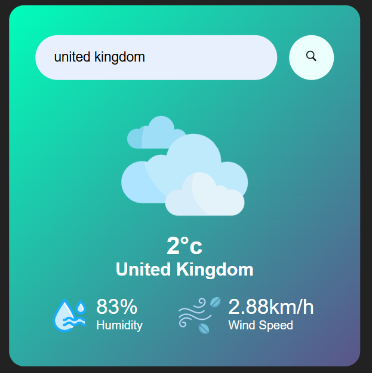

# 🌦 Weather Application

This is a simple **Weather App** that allows users to check real-time weather conditions by entering a city name. The app fetches weather data using the **OpenWeatherMap API**.

## 🚀 Features
- 🌍 Get weather updates for any city
- 🌡 Displays temperature, humidity, and wind speed
- ☁️ Dynamic weather icons based on conditions
- 🔍 User-friendly search functionality

## 🛠️ Technologies Used
- HTML, CSS, JavaScript
- OpenWeatherMap API
- FontAwesome for icons

## 🎯 How to Use
1. Enter a city name in the search box.
2. Click the **search button** 🔍.
3. View real-time weather details.

## 📸 Screenshots
## 📸 Screenshots
[](https://github.com/Tharushi-Nathasha/Weather-Application)

## 📦 Installation & Setup
1. Clone the repository:
   ```bash
   git clone https://github.com/Tharushi-Nathasha/Weather-Application.git
